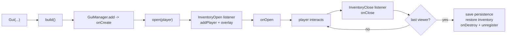

# UplineGuiApi

**Advanced custom GUI API for Paper plugins, written in Kotlin.**

UplineGuiApi turns Bukkit's raw `InventoryClickEvent` plumbing into a small, declarative
model: describe a GUI, attach callbacks, call `build()` and `open()`. The plugin takes care
of click filtering, drag protection, shift-click routing, player-inventory overlays,
inventory backup/restore and optional persistence of the GUI contents into an item or entity.

| | |
|---|---|
| **Platform** | Paper `26.2` (`api-version: 26.2`) |
| **Language** | Kotlin `2.3.20` (Java 25 toolchain) |
| **Type** | Standalone plugin that other plugins depend on |
| **Version** | `1.4` |
| **Repository** | [UplineServers/UplineGuiApi](https://github.com/UplineServers/UplineGuiApi) |

---

## Table of contents

- [Features](#features)
- [Requirements](#requirements)
- [Installation](#installation)
- [Using it from your plugin](#using-it-from-your-plugin)
- [Quick start](#quick-start)
- [Core concepts](#core-concepts)
  - [Gui](#gui)
  - [GuiItem](#guiitem)
  - [Interaction rules](#interaction-rules)
  - [Slots and the extra inventory](#slots-and-the-extra-inventory)
  - [Lifecycle](#lifecycle)
  - [Persistence](#persistence)
- [Commands and permissions](#commands-and-permissions)
- [Configuration](#configuration)
- [Building from source](#building-from-source)
- [API documentation](#api-documentation)
- [Releasing (maintainers)](#releasing-maintainers)
- [Project structure](#project-structure)
- [Notes and caveats](#notes-and-caveats)
- [Documentation](#documentation)
- [Credits](#credits)

---

## Features

- **Declarative GUIs** — one `Gui` object holds the title, size, items, flags and callbacks.
- **Per-item click handlers** — every `GuiItem` carries its own `onClick` lambda.
- **Fine-grained interaction control** — allow or deny putting and taking items per GUI or
  per slot, and block shift-click transfers entirely.
- **MiniMessage titles** — titles are deserialized with
  [MiniMessage](https://docs.advntr.dev/minimessage/format.html), and changing `gui.title`
  at runtime live-reopens the inventory for every viewer.
- **Player-inventory overlay** — extend a GUI past slot 53 into the player's own inventory.
  The real inventory is backed up on open and restored on close.
- **Persistence** — bind a GUI's contents to an `ItemStack` or an `Entity` and they are
  stored in that object's persistent data container (backpacks, bound containers, ...).
- **Multi-viewer aware** — several players can share one GUI id; the GUI is disposed only
  when the last viewer leaves.
- **Safe by default** — drops, pickups and clicks are blocked while a GUI is updating, and
  the item a GUI is bound to can never be moved out of the player's inventory.
- **Built-in live demos** — six runnable examples behind `/uplineguiapi test`.

---

## Requirements

- A **Paper** server on version **26.2** (Spigot/Bukkit is not supported — the API uses
  Paper's Adventure components).
- **Java 25** or newer.
- The Kotlin standard library is shaded into the jar, so no extra runtime dependency is needed.

---

## Installation

1. Grab `UplineGuiApi-<version>-all.jar` from a release, or [build it yourself](#building-from-source).
2. Drop it into your server's `plugins/` folder.
3. Start the server once — this generates `plugins/UplineGuiApi/config.yml`.
4. Verify with `/uplineguiapi info`.

> Install the **`-all.jar`** (the shadow jar). The plain `UplineGuiApi-<version>.jar` does not
> contain the bundled Kotlin standard library and will fail at runtime.

---

## Using it from your plugin

### 1. Declare the dependency in `plugin.yml`

```yaml
name: MyPlugin
main: com.example.myplugin.MyPlugin
api-version: '26.2'
depend: [ UplineGuiApi ]
```

### 2. Add the dependency

The API is published as `com.uplineservers:uplineguiapi`. Pick whichever repository the release
you want lives in — the artifact and coordinates are identical, only the host differs.

<details open>
<summary><b>Gradle (Kotlin DSL)</b></summary>

```kotlin
repositories {
    mavenCentral()
    maven("https://repo.papermc.io/repository/maven-public/")
    maven("https://jitpack.io")                                    // JitPack releases
}

dependencies {
    compileOnly("io.papermc.paper:paper-api:26.2.build.+")
    compileOnly("com.github.UplineServers:UplineGuiApi:1.4")          // via JitPack
}
```

</details>

<details>
<summary><b>Gradle (Groovy DSL)</b></summary>

```groovy
repositories {
    mavenCentral()
    maven { url = 'https://repo.papermc.io/repository/maven-public/' }
    maven { url = 'https://jitpack.io' }
}

dependencies {
    compileOnly 'io.papermc.paper:paper-api:26.2.build.+'
    compileOnly 'com.github.UplineServers:UplineGuiApi:1.4'
}
```

</details>

<details>
<summary><b>Maven</b></summary>

```xml
<repositories>
  <repository>
    <id>papermc</id>
    <url>https://repo.papermc.io/repository/maven-public/</url>
  </repository>
  <repository>
    <id>jitpack</id>
    <url>https://jitpack.io</url>
  </repository>
</repositories>

<dependencies>
  <dependency>
    <groupId>io.papermc.paper</groupId>
    <artifactId>paper-api</artifactId>
    <version>26.2.build.124-stable</version>
    <scope>provided</scope>
  </dependency>
  <dependency>
    <groupId>com.github.UplineServers</groupId>
    <artifactId>UplineGuiApi</artifactId>
    <version>1.4</version>
    <scope>provided</scope>
  </dependency>
</dependencies>
```

</details>

<details>
<summary><b>A local jar, with no repository at all</b></summary>

```kotlin
dependencies {
    compileOnly(files("libs/UplineGuiApi-1.4.jar"))
    // Kotlin's stdlib is part of the API surface (callbacks are Function1):
    compileOnly("org.jetbrains.kotlin:kotlin-stdlib-jdk8:2.3.20")
}
```

</details>

Always use **`compileOnly` / `provided`**: UplineGuiApi is a separate plugin on the server, so it
must not be shaded into your own jar. Declaring `depend: [ UplineGuiApi ]` in your `plugin.yml`
is what puts it on your runtime classpath.

### 3. Import what you need

```kotlin
import com.uplineservers.uplineguiapi.models.Gui
import com.uplineservers.uplineguiapi.models.GuiItem
import com.uplineservers.uplineguiapi.models.EXTRA_INVENTORY
import com.uplineservers.uplineguiapi.models.SHIFT_PROTECTION
import com.uplineservers.uplineguiapi.services.GuiManager
```

> **Java users:** the API works from Java — `new Gui()`, `gui.setId(...)`, `gui.setTitle(...)`,
> `gui.getItems().put(slot, new GuiItem(stack, false, event -> { ...; return Unit.INSTANCE; }))`.
> Two rough edges: callbacks are `kotlin.jvm.functions.Function1`, so lambdas must `return
> Unit.INSTANCE`, and read-only fields such as `size`, `isPutable`, `isTakeable`, `extraSize` and
> `shiftProtection` have no setters — from Java they can only be set by passing *every* constructor
> argument. Kotlin remains the intended language.

---

## Quick start

A three-slot menu with one clickable button:

```kotlin
fun openMainMenu(player: Player) {
    // Reuse the GUI if it is already registered (shared state between viewers).
    GuiManager.getById("main_menu")?.let { return it.open(player) }

    val gui = Gui(
        id = "main_menu",
        title = "<gold><bold>Main Menu",
        size = 27,
    )

    val icon = ItemStack(Material.DIAMOND_SWORD).apply {
        itemMeta = itemMeta.apply {
            displayName(Component.text("Click me"))
            lore(listOf(Component.text("An example button.")))
        }
    }

    gui.items[13] = GuiItem(icon) { event ->
        event.whoClicked.sendMessage("You clicked the button!")
    }

    gui.onOpen = { it.player.sendMessage("Welcome!") }
    gui.onClose = { it.player.sendMessage("See you.") }

    gui.build()        // register + create the inventory
    gui.open(player)   // show it
}
```

That is the whole flow: **construct → fill `items` → `build()` → `open()`**.

For a step-by-step walkthrough see **[docs/TUTORIAL.md](docs/TUTORIAL.md)**; for ready-made
patterns see **[docs/EXAMPLES.md](docs/EXAMPLES.md)**; for every field and method see
**[docs/API.md](docs/API.md)**.

---

## Core concepts

### Gui

`com.uplineservers.uplineguiapi.models.Gui` is the single object you work with.

| Property | Type | Default | Description |
|---|---|---|---|
| `id` | `String` | random UUID | Unique key in `GuiManager`. Building twice with the same id throws. |
| `type` | `InventoryType` | `CHEST` | Any Bukkit inventory type. Non-chest types ignore `size`. |
| `title` | `String` | `"Custom GUI"` | MiniMessage string. Assigning a new value rebuilds and reopens the inventory for all viewers. |
| `size` | `Int` | `27` | Chest slot count, must be a multiple of 9. |
| `extraSize` | `EXTRA_INVENTORY?` | `null` | Enables the player-inventory overlay (`MAIN` or `FULL`). |
| `items` | `MutableMap<Int, GuiItem>` | empty | Slot → item mapping. |
| `isPutable` | `Boolean` | `false` | Default rule for placing items into GUI slots. |
| `isTakeable` | `Boolean` | `false` | Default rule for taking items out of GUI slots. |
| `isUpdating` | `Boolean` | `false` | While `true`, all clicks and drops are cancelled. |
| `shiftProtection` | `SHIFT_PROTECTION` | `NONE` | `BLOCK` cancels every shift-click. |
| `inventory` | `Inventory?` | `null` | The live Bukkit inventory; set by `build()`. |
| `dataItem` | `ItemStack?` | `null` | Persist contents into this item. |
| `dataEntity` | `Entity?` | `null` | Persist contents into this entity. |

Methods:

| Method | Description |
|---|---|
| `build()` | Creates the Bukkit inventory, loads persisted contents and registers the GUI. Call once. |
| `open(player)` | Opens the built inventory for a player. Throws if `build()` was not called. |
| `update()` | Recreates the inventory (used after a title change) and reopens it for all viewers. |
| `updateSlot(slot, player)` | Pushes a single slot from `items` back into the inventory (or the player's inventory for overlay slots). |
| `addPlayer(player)` | Registers a viewer manually; normally handled by the open listener. |

Callbacks — all nullable `var`s you can assign at any time:

| Callback | Signature | Fires |
|---|---|---|
| `onOpen` | `(InventoryOpenEvent) -> Unit` | After the viewer is registered and the overlay is applied. |
| `onClose` | `(InventoryCloseEvent) -> Unit` | Before the viewer is removed and inventories restored. |
| `onClick` | `(InventoryClickEvent) -> Unit` | First thing on every click; cancel the event to stop all further handling. |
| `onCreate` | `(Gui) -> Unit` | When the GUI is added to `GuiManager` during `build()`. |
| `onDestroy` | `(Gui) -> Unit` | When the last viewer leaves and the GUI is disposed. |

### GuiItem

```kotlin
GuiItem(
    item: ItemStack,
    isMovable: Boolean = false,
    onClick: (InventoryClickEvent) -> Unit = { },
)
```

- `isMovable = false` (default) makes the item a **locked button**: it can be clicked but not
  taken or replaced, regardless of the GUI's `isPutable` / `isTakeable`. A random
  `minecraft:item_uuid` is written into the item's persistent data so two visually identical
  buttons never stack or get confused with a player's own items.
- `isMovable = true` overrides both GUI flags for that slot and lets players move the item freely.
- `onClick` runs before the interaction rules are evaluated, so cancelling the event inside it
  short-circuits everything else.

### Interaction rules

For a click on a GUI slot, the effective rules are resolved in this order:

```
gui.isUpdating              -> cancel everything
gui.onClick                 -> if it cancels, stop
item has minecraft:gui_blocked = true (PDC boolean) -> cancel
shift-click + SHIFT_PROTECTION.BLOCK -> cancel
guiItem.onClick             -> if it cancels, stop
slot rule = guiItem.isMovable ?: (gui.isPutable / gui.isTakeable)
```

Marking any `ItemStack` with the persistent-data key `minecraft:gui_blocked` set to `true`
makes it untouchable inside any UplineGuiApi GUI — handy for filler panes and decorations that
live outside `items`.

### Slots and the extra inventory

| Slot range | Where it lives | Requires |
|---|---|---|
| `0` – `size-1` | The chest/GUI inventory | — |
| `54` – `80` | Player storage slots `9` – `35` | `extraSize = MAIN` or `FULL` |
| `81` – `89` | Player hotbar slots `0` – `8` | `extraSize = FULL` |

The mapping is `playerSlot = slot - 45` below 81, and `playerSlot = slot - 81` from 81 up.
Setting an item above slot 53 without an `extraSize`, or above slot 80 without
`EXTRA_INVENTORY.FULL`, throws at `build()` time.

When an overlay GUI opens, the player's real inventory is saved to memory and cleared
(`MAIN` clears storage slots 9–35, `FULL` clears everything and remembers the held slot), then
restored when the GUI closes. Item pickup is also blocked while an overlay GUI is open so
nothing is lost.

### Lifecycle



Because a GUI is unregistered once its last viewer closes it, the common pattern is to look it
up first and rebuild only when missing:

```kotlin
GuiManager.getById("my_gui")?.let { return it.open(player) }
```

Use a shared id when viewers should see the same live contents, and a per-player id
(`"my_gui_" + player.uniqueId`) when state must be isolated.

### Persistence

Set `dataItem` or `dataEntity` before calling `build()`:

```kotlin
val gui = Gui(
    id = "backpack_" + player.uniqueId,
    title = "<yellow>Backpack",
    size = 27,
    isPutable = true,
    isTakeable = true,
    dataItem = player.inventory.itemInMainHand,
)
gui.build()   // contents are loaded from the item
gui.open(player)
```

Contents are serialized to JSON and written to the holder's persistent data container under
`uplineguiapi:stored_inventory`. Saving happens when a viewer closes the GUI and again on
server shutdown. If the serialized payload exceeds [`maxSize`](#configuration), the save is
skipped and a warning is logged. The bound `dataItem` itself is click-proof while its GUI is
open, so a player cannot drop or move the item the open GUI is stored in.

---

## Commands and permissions

| Command | Description |
|---|---|
| `/uplineguiapi` | Shows usage. Alias: `/uplinegui`. |
| `/uplineguiapi info` | Prints how many GUIs are registered and how many players are viewing one. |
| `/uplineguiapi test <demo>` | Opens a built-in demo (players only). |

Demos: `menu`, `putable`, `takeable`, `moveable`, `item`, `inventory` — see
[docs/EXAMPLES.md](docs/EXAMPLES.md).

| Permission | Default | Grants |
|---|---|---|
| `uplinegui.use` | operators | Access to `/uplineguiapi` and all subcommands. |

---

## Configuration

`plugins/UplineGuiApi/config.yml`:

```yaml
# Maximum length (in characters) of the serialized JSON written into an item's or
# entity's persistent data when a GUI uses dataItem / dataEntity.
# Saves larger than this are skipped and logged as a warning.
maxSize: 32767
```

---

## Building from source

```bash
./gradlew build
```

The shaded plugin jar lands in `build/libs/UplineGuiApi-<version>-all.jar`.

To start a Paper 26.2 test server with the plugin already installed (via
[run-paper](https://github.com/jpenilla/run-task)):

```bash
./gradlew runServer
```

The server runs in `run/`, which is git-ignored.

---

## API documentation

Reference docs are written as **KDoc** — Kotlin's Javadoc — directly above the declarations in
`src/main/kotlin/`:

```kotlin
/**
 * One slot of a [Gui]: the stack shown there and what happens when it is clicked.
 *
 * @property isMovable `false` locks the slot: the item can be clicked but never taken.
 */
data class GuiItem(/* ... */)
```

Square brackets like `[Gui]` become links, `@property` / `@param` / `@return` / `@throws`
document members, and fenced blocks render as examples. Package-level and module-level prose
lives in [docs/module.md](docs/module.md).

[Dokka](https://kotl.in/dokka) renders it all into a static site:

```bash
./gradlew dokkaGenerate      # -> build/docs/api/index.html
```

[`.github/workflows/docs.yml`](.github/workflows/docs.yml) republishes it to GitHub Pages on every
push to `main`. Enable it once under **Settings → Pages → Source: GitHub Actions**.

Consumers also get the KDoc inline in their IDE without any of this, because the build publishes a
sources jar next to the API jar.

> **Local generation on a Homebrew JDK:** Dokka's embedded Kotlin compiler cannot parse Homebrew's
> four-part version strings (`25.0.4.1`) and fails with `IllegalArgumentException: 25.0.4.1`. It is
> the Gradle daemon's JVM that matters, not the toolchain, so run it against any JDK with a normal
> three-part version:
>
> ```bash
> ./gradlew dokkaGenerate -Dorg.gradle.java.home=/Library/Java/JavaVirtualMachines/temurin-24.jdk/Contents/Home
> ```
>
> CI is unaffected — Temurin reports `25.0.1`.

---

## Releasing (maintainers)

The build applies `maven-publish`, so the API jar, a sources jar and the shaded `-all` jar are all
publishable under `com.uplineservers:uplineguiapi`.

```bash
./gradlew publishToMavenLocal        # into ~/.m2, for testing a consumer locally
./gradlew publish                    # to every configured remote repository
```

### JitPack (zero setup, what the snippets above use)

1. Push a git tag: `git tag 1.4 && git push origin 1.4`.
2. Open `https://jitpack.io/#UplineServers/UplineGuiApi` and click **Get it** on the tag.

JitPack builds the tag with [`jitpack.yml`](jitpack.yml) and serves it at
`com.github.UplineServers:UplineGuiApi:<tag>`. Nothing to configure and no credentials — consumers
just add the `https://jitpack.io` repository. Check the build log for the exact coordinates it
published.

### GitHub Packages

[`.github/workflows/publish.yml`](.github/workflows/publish.yml) publishes on every GitHub release
and attaches the shaded jar to it. The `GitHubPackages` repository in `build.gradle.kts` reads
`GITHUB_ACTOR` / `GITHUB_TOKEN` (provided automatically in Actions) or the `gpr.user` / `gpr.key`
Gradle properties locally.

Be aware that **reading** from GitHub Packages requires consumers to authenticate with a GitHub
token, which is real friction for a public API — treat it as an internal mirror rather than the
main channel.

### A self-hosted repository

If Upline runs its own [Reposilite](https://reposilite.com) or Nexus, add it next to the
GitHub Packages block and consumers get clean, auth-free coordinates:

```kotlin
publishing {
    repositories {
        maven {
            name = "upline"
            url = uri("https://repo.uplineservers.com/releases")
            credentials(PasswordCredentials::class)   // uplineUsername / uplinePassword in ~/.gradle/gradle.properties
        }
    }
}
```

```kotlin
// consumer side
repositories { maven("https://repo.uplineservers.com/releases") }
dependencies { compileOnly("com.uplineservers:uplineguiapi:1.4") }
```

### Maven Central

Possible but the heaviest option: it needs a verified namespace (ownership of `uplineservers.com`,
or the `io.github.uplineservers` group), GPG-signed artifacts and a javadoc jar (via Dokka for
Kotlin). Worth it only once the API is stable and widely used.

---

## Project structure

```
.github/workflows/publish.yml    # release -> GitHub Packages + release asset
.github/workflows/docs.yml       # push to main -> KDoc site on GitHub Pages
docs/module.md                   # module and package prose for the KDoc site
jitpack.yml                      # JitPack build configuration
src/main/kotlin/com/uplineservers/uplineguiapi/
├── UplineGuiApi.kt              # plugin entry point, holds the singleton instance
├── commands/
│   ├── CommandRegisterer.kt     # /uplineguiapi dispatcher + tab completion
│   ├── InfoCommand.kt           # /uplineguiapi info
│   └── TestCommand.kt           # /uplineguiapi test <demo>
├── examples/                    # the six runnable demos
├── listeners/
│   ├── InventoryOpen.kt         # registers viewers, applies the overlay
│   ├── InventoryClose.kt        # persists, restores inventories, disposes GUIs
│   ├── InventoryClick.kt        # the interaction rule engine
│   ├── InventoryDrag.kt         # drag protection
│   ├── ItemDrop.kt / ItemPick.kt# drop & pickup guards
│   └── ListenerRegisterer.kt
├── models/
│   ├── Gui.kt                   # Gui, SHIFT_PROTECTION, EXTRA_INVENTORY
│   └── GuiItem.kt
└── services/
    ├── GuiBuild.kt              # inventory creation, updates, overlay building
    ├── GuiManager.kt            # registry of GUIs and viewers
    ├── GuiStore.kt              # persistence into item/entity PDC
    └── InventoryManager.kt      # backup & restore of real player inventories
```

---

## Notes and caveats

- `build()` must be called exactly once per GUI id; a second call while the id is still
  registered throws `IllegalArgumentException`.
- `open()` before `build()` throws `IllegalStateException`.
- Chest sizes must be multiples of 9; other `InventoryType`s use their natural size and ignore
  the `size` field.
- Changing `title` recreates the inventory, which makes the client briefly reopen the screen.
- GUI state lives in memory only. Anything that must survive a restart belongs in `dataItem`
  or `dataEntity`, or in your own storage.
- The demo GUIs in `examples/` use legacy `§` colour codes; new code should use MiniMessage
  tags such as `<gold><bold>`.

---

## Documentation

| Document | Contents |
|---|---|
| [docs/TUTORIAL.md](docs/TUTORIAL.md) | Step-by-step guide from an empty menu to overlays and persistence. |
| [docs/EXAMPLES.md](docs/EXAMPLES.md) | The six built-in demos explained, with the patterns behind them. |
| [docs/API.md](docs/API.md) | Complete reference for every public class, field and method. |
| Generated KDoc | `./gradlew dokkaGenerate`, or the GitHub Pages site once enabled. |

---

## Credits

Built by **Emanuel Scura** for [Upline Servers](https://emanuelscura.me).
